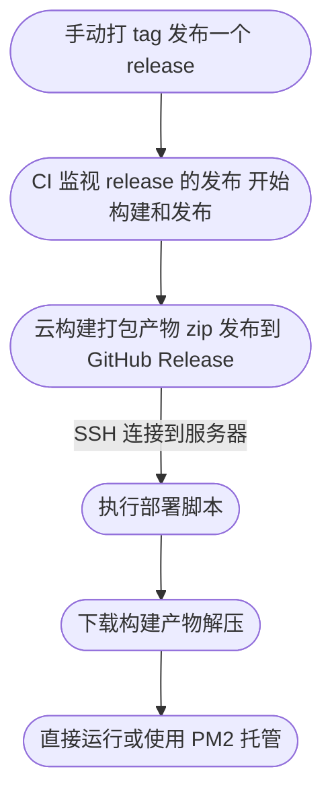

> 影响大众想象力的，并不是事实本身，而是它扩散和传播的方式。

↑ 引用

# Test 文本

> 影响大众想象力的，并不是事实本身，而是它扩散和传播的方式。

# 一级

我与父亲不相见已二年余了，我最不能忘记的是他的背影。

那年冬天，祖母死了，父亲的差使也交卸了，正是祸不单行的日子。我从北京到徐州，打算跟着父亲奔丧回家。到徐州见着父亲，看见满院狼藉的东西，又想起祖母，不禁簌簌地流下眼泪。父亲说：“事已如此，不必难过，好在天无绝人之路！”

## 二级

回家变卖典质，父亲还了亏空；又借钱办了丧事。这些日子，家中光景很是惨澹，一半为了丧事，一半为了父亲赋闲。丧事完毕，父亲要到南京谋事，我也要回北京念书，我们便同行。

到南京时，有朋友约去游逛，勾留了一日；第二日上午便须渡江到浦口，下午上车北去。父亲因为事忙，本已说定不送我，叫旅馆里一个熟识的茶房陪我同去。他再三嘱咐茶房，甚是仔细。但他终于不放心，怕茶房不妥帖；颇踌躇了一会。其实我那年已二十岁，北京已来往过两三次，是没有什么要紧的了。他踌躇了一会，终于决定还是自己送我去。我再三劝他不必去；他只说：“不要紧，他们去不好！”

### 三级

> 影响大众想象力的，并不是事实本身，而是它扩散和传播的方式。

#### 四级

\`code: \`

```tsx
<ReactMarkdown
  // source={value}
  source={}
  {...rest}
  renderers={{
    code: CodeBlock,
    pre: CodeBlock,
    image: Image,
    heading: Heading(),
    link: RenderLink,
    spoiler: RenderSpoiler,
    paragraph: RenderParagraph,
    // eslint-disable-next-line react/display-name
    commentAt: RenderCommentAt,
    ...renderers,
  }}
  plugins={CustomRules}
/>
```

|| 你知道的太多了 || spoiler || 你知道的太多了 ||

[链接](https://baidu.com)


↑ 图片描述

**加粗: 歌词**

~~dele~~ 删除



mention: (@Innei)

> _夕暮れ_
>
> 作詞：甲本ヒロト
> 作曲：甲本ヒロト
>
> はっきりさせなくてもいい  
> あやふやなまんまでいい  
> 僕達はなんなとなく幸せになるんだ
>
> 何年たってもいい　遠く離れてもいい  
> 独りぼっちじゃないぜウィンクするぜ
>
> 夕暮れが僕のドアをノックする頃に  
> あなたを「ギュッ」と抱きたくなってる  
> 幻なんかじゃない　人生は夢じゃない  
> 僕達ははっきりと生きてるんだ  
> 夕焼け空は赤い　炎のように赤い  
> この星の半分を真っ赤に染めた  
> それよりももっと赤い血が  
> 体中を流れてるんだぜ  
> 夕暮れが僕のドアをノックする頃に
>
> あなたを「ギュッ」と抱きたくなってる  
> 幻なんかじゃない　人生は夢じゃない  
> 僕達ははっきりと生きてるんだ
>
> 夕焼け空は赤い　炎のように赤い  
> この星の半分を真っ赤に染めた
>
> それよりももっと赤い血が  
> 体中を流れてるんだぜ  
> 体中を流れてるんだぜ  
> 体中を流れてるんだぜ
